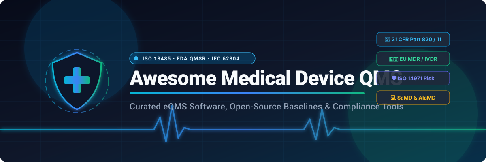
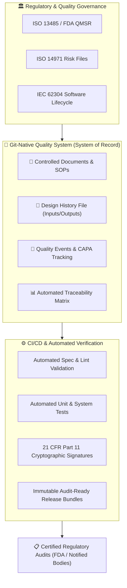

# 🏥 Awesome Medical Device QMS

  

  
  
  
  
  
  

---

## 📖 Introduction & Overview

A comprehensive, curated index of **Medical Device Quality Management System (QMS / eQMS) software**, frameworks, and open-source compliance platforms. This directory covers industry-standard tools designed for compliance with **ISO 13485:2016, ISO 14971:2019, FDA QMSR / 21 CFR Part 820, 21 CFR Part 11, IEC 62304, IEC 62366-1, EU MDR (2017/745), EU IVDR (2017/746), and MDSAP**.

Medical Device QMS platforms systematically orchestrate core regulatory workflows:
- 📑 **Document & Record Control:** Controlled versioning, approval workflows, and audit trails.
- 🎯 **Design Controls & DHF:** Design inputs, outputs, verification, validation, and design transfer.
- 🛡️ **Risk Management (ISO 14971):** Hazard analysis, FMEA, risk evaluation, and risk-benefit analysis.
- 🔄 **CAPA & Nonconformance:** Corrective and Preventive Actions, defect investigations, and containment.
- 🔍 **Audits & Supplier Quality:** Internal audit scheduling, findings management, and supplier qualification.
- 📊 **Post-Market Surveillance (PMS):** Customer complaints, vigilance reporting, and trend analysis.
- 💻 **Software as a Medical Device (SaMD / AIaMD):** IEC 62304 lifecycle management, algorithm change protocols, and cybersecurity.

---

## 📑 Table of Contents

- [☁️ SaaS / Commercial eQMS Platforms](#️-saas--commercial-eqms-platforms)
- [🌍 Open-Source QMS & Compliance Projects](#-open-source-qms--compliance-projects)
- [🧩 Open-Source QMS Templates & Regulatory Building Blocks](#-open-source-qms-templates--regulatory-building-blocks)
- [🛠️ Open-Source Infrastructure Building Blocks](#️-open-source-infrastructure-building-blocks)
- [📚 Standards & Regulatory Frameworks](#-standards--regulatory-frameworks)
- [🧱 Git-Native Medical Device QMS Architecture](#-git-native-medical-device-qms-architecture)
- [🔍 Commercial vs. Open-Source Comparison](#-commercial-vs-open-source-comparison)
- [📈 Star History](#-star-history)
- [🤝 How to Contribute](#-how-to-contribute)
- [⚠️ Disclaimer](#️-disclaimer)

---

## ☁️ SaaS / Commercial eQMS Platforms

> 📊 **Market Size & Structure:** The global Medical Device & Life Sciences eQMS software market is estimated at **$2.8 Billion – $3.8 Billion (projected to exceed $6.5 Billion by 2030 with a ~12–14% CAGR)**. The sector is **moderately fragmented**—anchored at the top by enterprise life-sciences conglomerates (Honeywell/Sparta, Veeva Systems, Hexagon/ETQ, PTC Arena) alongside specialized medtech leaders (MasterControl, Greenlight Guru, Qualio), with agile configurable platforms serving mid-market manufacturers and digital health startups rather than a single winner-take-all monopoly.

| 🏢 Platform | 📝 Description | 🎯 Primary Focus | 💰 Pricing (Starting Tier) | 🎁 Free Tier / Free Trial Limits | 📊 Company Size / Valuation / Revenue |
| :--- | :--- | :--- | :--- | :--- | :--- |
| [TrackWise Digital](https://www.spartasystems.com/trackwise/) | AI-enabled enterprise cloud QMS from Sparta Systems / Honeywell Life Sciences supporting quality events, CAPA, deviations, complaints, audits, supplier quality, and regulatory analytics. | Enterprise Quality, Life Sciences | Starting at ~$200/user/month (~$25,000/year minimum platform baseline) | No free-forever tier; No self-service free trial (guided enterprise solution demo available on request) | **Honeywell:** ~$140B+ Market Cap (Sparta acquired for $1.3B; ~$100M+ revenue) |
| [Veeva Vault QMS](https://www.veeva.com/products/vault-quality/) | Enterprise life-sciences quality platform supporting global quality events, document governance, training, audits, complaints, CAPA, supplier management, and validation. | Life Sciences, Enterprise QMS | Starting at ~$25,000/year base platform fee + ~$600 – $2,400/user/year | No free tier for Vault QMS (free SiteVault plan limited to clinical trial sites up to 20 active studies); live demo on request | **Veeva Systems (NYSE: VEEV):** ~$32B Market Cap, ~$2.5B+ Annual Revenue |
| [ETQ Reliance](https://www.etq.com/) | Configurable enterprise QMS supporting end-to-end quality processes including CAPA, document control, internal audits, customer complaints, supplier quality, and nonconformance. | Enterprise QMS, Quality Automation | Starting at ~$25,000/year (tiered enterprise subscription based on concurrent users and deployed modules) | No free-forever tier; No self-service free trial (live vendor walkthrough and requirement consultation on request) | **Hexagon AB:** ~$30B Market Cap (ETQ acquired for $1.2B in 2022; ~$75M+ revenue) |
| [Arena QMS](https://www.ptc.com/en/products/arena) | Cloud product lifecycle management (PLM) and quality management platform integrating product development, quality control, supplier management, and design traceability. | Product Development, Medical Devices | Starting at ~$1,200 – $2,500/user/year (minimum entry starting at ~$10,000/year for Launch tier) | 14-day to 30-day guided evaluation trial available upon vendor request (no permanent free tier) | **PTC Inc. (NASDAQ: PTC):** ~$21B Market Cap (Arena acquired for $715M; ~$2.2B revenue) |
| [MasterControl](https://www.mastercontrol.com/) | Enterprise digital quality management and manufacturing platform covering document control, employee training, audits, CAPA, quality events, and risk. | Enterprise QMS, Medical Devices, Life Sciences | Starting at ~$25,000/year (named-user licensing model; enterprise installations scale to $100,000+/year) | No free-forever tier; No self-service free trial (custom live product demonstration available on request) | **MasterControl:** ~$1.3B+ Valuation (Unicorn status; ~$150M+ Annual ARR) |
| [Greenlight Guru](https://www.greenlight.guru/) | Medical-device-specific eQMS platform connecting quality management, design controls, ISO 14971 risk management, clinical evidence, and submission workflows. | Medical Devices, Design Controls, ISO 14971, CAPA | Starting at ~$12,000 – $25,000/year (billed annually; scales to $60,000+/year based on modules & seats) | No free-forever tier; No self-service free trial (guided interactive product tour & live demo available on request) | **Greenlight Guru:** ~$300M+ Valuation ($120M PE investment from JMI; ~$35M–$50M ARR) |
| [Qualio](https://www.qualio.com/) | Cloud-native QMS built for growing life sciences and medical device companies, featuring automated document control, training, design controls, risk, supplier management, and audits. | Medical Devices, SaMD, ISO 13485 | Starting at ~$12,000 – $25,000/year (Foundation tier, billed annually; scales for Growth and Enterprise) | No free-forever tier; No self-service free trial (guided sandbox walkthrough & sales demo available on request) | **Qualio:** ~$150M–$200M Valuation ($60M+ venture funding led by Tiger Global; ~$20M–$30M ARR) |
| [ComplianceQuest](https://www.compliancequest.com/) | Native Salesforce cloud QMS and EHS suite supporting medical-device quality workflows, CAPA, audits, document control, supplier ratings, complaints, and risk management. | Medical Devices, Life Sciences, Enterprise QMS | Starting at ~$30/user/month (~$15,000 – $25,000/year starting baseline for life-sciences configurations) | No free-forever tier; No self-service free trial (guided proof of concept & tailored live demo available on request) | **ComplianceQuest:** ~$100M–$150M Valuation ($36M+ funding; ~$15M–$25M ARR) |
| [Dot Compliance](https://www.dotcompliance.com/) | Ready-to-use AI-enabled life sciences eQMS offering out-of-the-box quality processes including document management, CAPA, deviations, training, and change control. | Life Sciences, Medical Devices | Starting at ~$20,000 – $25,000/year (annual SaaS subscription scaled by user seats and regulatory modules) | 14-day free trial available (access to core out-of-the-box QMS and document management workflows upon request) | **Dot Compliance:** ~$80M–$120M Valuation ($38M+ Series B funding; ~$10M–$20M ARR) |
| [AssurX](https://www.assurx.com/) | Configurable quality and regulatory compliance management platform supporting CAPA, complaint handling, supplier quality, document control, training, and risk workflows. | QMS, Compliance, Regulated Industries | Starting at ~$20,000 – $25,000/year (annual pay-as-you-go subscription based on active user licensing) | No free-forever tier; No self-service free trial (interactive live workflow demonstration available on request) | **AssurX:** Bootstrapped & profitable enterprise (~$15M–$30M Annual ARR) |
| [Intellect QMS](https://www.intellect.com/) | Highly configurable no-code QMS platform enabling medical-device teams to customize document control, CAPA, audits, training, and compliance workflows. | Enterprise QMS, No-Code Quality | Starting at $19,000/year (Pro Plan; Core Plan at ~$26,000/year for 5 users, Premier at $29,000/year) | No free-forever tier; No self-service free trial (customized workflow demonstration and pilot available on request) | **Intellect:** Private Enterprise (~$10M–$25M Annual ARR) |
| [ZenQMS](https://www.zenqms.com/) | Cloud-based eQMS focused on accessible document control, employee training, CAPA, audits, supplier quality, and 21 CFR Part 11 electronic signatures. | QMS, Regulated Industries | Starting at ~$18,000 – $25,000/year (unlimited user pricing model with no per-seat penalty fees) | No free-forever tier; No self-service free trial (guided system demonstration & compliance consultation on request) | **ZenQMS:** Private Equity / Growth backed (~$10M–$20M Annual ARR) |
| [QualiWare](https://www.qualiware.com/) | Enterprise architecture and quality process-management platform supporting quality frameworks, governance, compliance modeling, and ISO standards. | Enterprise Quality, Process Management | Starting at ~$12 – $50/user/month (Starter / EDGY packages starting at ~$15,000/year on subscription) | Guided sandbox trial available upon vendor request (no permanent free tier; live customized demo provided) | **QualiWare:** Private Enterprise (~$10M–$20M Annual ARR) |
| [QT9 QMS](https://www.qt9software.com/qms/) | Manufacturing and medical device QMS platform featuring document control, CAPA, nonconformance, supplier management, calibration, and audit management. | Manufacturing, Medical Devices | Starting at ~$20,000 – $25,000/year (concurrent user model; includes all 25+ modules and unlimited support) | 30-day free trial available (full access to all 25+ modules with custom company data testing; no credit card required) | **QT9 Software:** Private SaaS (~$5M–$15M Annual ARR) |

---

## 🌍 Open-Source QMS & Compliance Projects

> ⭐ **Open-source medical-device QMS software is rapidly maturing.** The repositories below range from production-grade eQMS platforms and Git-native regulatory engines to specialized SaMD compliance frameworks, sorted by community adoption.

| 📦 Project | 📝 Description | 🎯 Best Use |
| :--- | :--- | :--- |
| [OpenRegulatory Templates](https://github.com/openregulatory/templates)  | Open-source regulatory and quality documentation templates covering ISO 13485, IEC 62304, ISO 14971 risk management, CAPA, design controls, and software verification. | ⭐ QMS Documentation, SOPs, Regulatory Templates |
| [QMS-Template](https://github.com/GSTT-CSC/QMS-Template)  | ISO 13485 QMS template developed by Guy's and St Thomas' NHS Trust for Software as a Medical Device (SaMD) and AI as a Medical Device (AIaMD). Includes SOPs, CAPA, and management reviews. | ⭐ SaMD & AIaMD ISO 13485 Implementation |
| [OpenQMS](https://github.com/C-realize/OpenQMS)  | Lightweight cloud-native open-source QMS application designed for quality management, document governance, and regulatory compliance workflows in life sciences. | Self-Hosted eQMS Application |
| [QMS ISO Lite](https://github.com/Techmentis/qms-iso-lite)  | Free and open-source Quality Management and Document Management System structured around ISO-standard process controls and approval workflows. | Lightweight ISO Document Control |
| [QAtrial](https://github.com/MeyerThorsten/QAtrial)  | Open-source AI-powered quality-management platform for regulated industries. Features design control, CAPA, deviations, eTMF, batch records, and compliance automation. | ⭐ AI-Powered eQMS for Medical Devices |
| [openQMS](https://github.com/evolunis/openQMS)  | MIT-licensed ISO 13485 quality-management-system repository containing a quality manual, design/development procedures, purchasing controls, and records infrastructure. | ⭐ ISO 13485 Quality Baseline |
| [LVGL Safe](https://github.com/lvgl/lvgl_safe)  | Certification-ready safety-critical UI framework for medical device embedded displays compliant with IEC 62304 Class C, ISO 26262, and IEC 61508. | Embedded Medical Device UI Compliance |
| [DearAuditor Open eQMS](https://github.com/AliakseiT/dearauditor-qms-baseline)  | GitHub-native eQMS baseline for medical device and regulated software teams. Utilizes GitHub Issues, PRs, Actions, and Releases as quality-system infrastructure. | ⭐ Medical Devices, SaMD, Git-Native QMS |
| [Open-EQMS](https://github.com/dromation/open-eqms)  | Open-source enterprise quality-management system built with Python and modern web technologies to handle document versioning and quality records. | Enterprise QMS Backend |
| [QARA Pulse eQMS](https://github.com/abonnet-qarapulse/qara-pulse-eqms)  | Open-source Git-native electronic Quality Management System core specifically tailored for SaMD and AI medical devices under ISO 13485 and IEC 62304. | Git-Native SaMD eQMS Core |
| [PiecePaperCode eQMS](https://github.com/PiecePaperCode/eqms)  | Electronic Quality Management System designed for software as a medical device (SaMD) teams striving for ISO 13485 compliance. | SaMD Quality Management |
| [SaMD Starter Kit](https://github.com/bryan-basg/samd-starter-kit)  | SaMD development kit and regulatory scaffolding covering IEC 62304, ISO 14971 risk management, and a complete Design History File (DHF) generator. | SaMD & AI Agent Regulatory Scaffolding |
| [SaMD QMS Workflow](https://github.com/jcafazzo/samd-qms-workflow)  | ISO 13485 QMS workflow skill for SaMD covering FDA QMSR, IEC 62304, ISO 14971, PCCP (Predetermined Change Control Plans), and GMLP AI controls. | AI/SaMD Quality & Change Control Workflows |
| [JAMB](https://github.com/vanandrew/jamb)  | IEC 62304 software requirement traceability and automated verification test mapping matrix for pytest suites. | Automated IEC 62304 Software Traceability |
| [MedTech Compliance Suite](https://github.com/paulmmoore3416/qualityandcomplianceapp)  | Full-stack medical device QMS application featuring risk matrices, CAPA tracking, NCRs, audit trails, and AI-assisted compliance verification. | Medical Device QMS Suite |
| [Bottle Light QMS](https://github.com/erroronline1/qualitymanagement)  | Lightweight QMS and documentation solution utilizing simple web technologies, VBA, Word, and Excel templates reported for ISO 13485 contexts. | Small Organizations, ISO 13485 |
| [Nestbox](https://github.com/aebarth/nestbox)  | Self-hosted document control and audit-trail system for scanned and PDF records supporting FDA QMSR and ISO 13485 compliance. | Regulated Recordkeeping & OCR Audit Trails |
| [Open QMS](https://github.com/IridiumSoftware/OpenQMS)  | GitHub-native open-source QMS generator composing regulatory modules, markdown templates, and traceability matrices covering ISO 13485, ISO 14971, and FDA 21 CFR 820. | Programmable GitHub QMS Generator |
| [MSTool-AI-QMS](https://github.com/nicolasbonilla/mstool-ai-qms)  | AI-native compliance platform for IEC 62304 Class C medical device software with automated static analysis, regulatory reasoning, and risk detection. | AI-Powered Software QMS Verification |

---

## 🧩 Open-Source QMS Templates & Regulatory Building Blocks

When establishing a **Git-native Quality Management System**, modular templates and document frameworks accelerate audit readiness:

### 🏥 Medical Device / ISO 13485 Frameworks
* 📋 **[OpenRegulatory Templates](https://github.com/openregulatory/templates)** — Complete open-source SOPs, Design History File templates, Clinical Evaluation reports, and Software Lifecycle documentation.
* 🏥 **[QMS-Template (Guy's & St Thomas')](https://github.com/GSTT-CSC/QMS-Template)** — NHS-developed ISO 13485 framework tailored for clinical AI models and digital health algorithms.
* 🛡️ **[DearAuditor Open eQMS](https://github.com/AliakseiT/dearauditor-qms-baseline)** — Turnkey quality system using Git branches, PR approval matrices, and CI release artifacts as audit-ready records.
* 📦 **[openQMS Baseline](https://github.com/evolunis/openQMS)** — Open-source ISO 13485 manual and procedure hierarchy for device manufacturers.

### 📋 Standard Quality Subsystems & Procedures
Open-source repositories provide reference templates for mandatory regulated processes:
- 📄 **Document & Record Control (SOP-01):** Authoring, review cycles, approval gates, distribution, and obsolescence.
- 📐 **Design Controls & Risk (SOP-02):** Design inputs, outputs, verification, validation, design freeze, and ISO 14971 FMEA.
- 🔄 **CAPA & Nonconformance (SOP-03):** Deviation logging, root-cause analysis (5-Whys/Ishikawa), and CAPA effectiveness checks.
- 🔍 **Internal & Supplier Audits (SOP-04):** Audit plans, objective evidence gathering, nonconformance escalation, and supplier scores.
- 👥 **Training Management (SOP-05):** Role matrices, training assignments, comprehension verification, and qualification logs.
- 📡 **Post-Market Surveillance & Complaints (SOP-06):** Customer feedback intake, MDR/vigilance decision trees, and trend reports.
- 💻 **Software Lifecycle (IEC 62304 SOP-07):** Software safety classification (Class A/B/C), SOUP management, and cybersecurity patches.

---

## 🛠️ Open-Source Infrastructure Building Blocks

Organizations can build validated, scalable QMS infrastructure by combining battle-tested open-source primitives:

| 🔧 Project | 📝 Description | 🎯 Role in an eQMS Infrastructure |
| :--- | :--- | :--- |
| [Git](https://git-scm.com/) | Distributed version-control system with cryptographically signed commits. | Immutable document version history & audit trails |
| [GitHub](https://github.com/) | Collaborative repository, issue tracking, pull request reviews, and Actions CI/CD. | Quality system-of-record & automated compliance checks |
| [GitLab](https://gitlab.com/) | Self-hosted DevSecOps platform with approvals, issues, and audit events. | Self-hosted Git-based QMS infrastructure |
| [Gitea](https://gitea.com/) / [Forgejo](https://forgejo.org/) | Lightweight self-hosted Git forges. | Air-gapped on-premise QMS document repositories |
| [Nextcloud](https://nextcloud.com/) | Secure self-hosted content collaboration and document management. | Controlled document distribution & team review |
| [OpenProject](https://www.openproject.org/) | Open-source enterprise project management with workflows and audit logs. | Quality project tracking, CAPA actions, and audit tasks |
| [ERPNext](https://github.com/frappe/erpnext) | Open-source ERP featuring manufacturing, purchasing, batch tracking, and QA. | Manufacturing controls, Device History Records (DHR) |
| [Odoo Community](https://github.com/odoo/odoo) | Modular business suite with quality inspection, inventory, and traceability. | Incoming inspection & supplier quality records |
| [NocoDB](https://github.com/nocodb/nocodb) | Open-source smart spreadsheet interface for relational databases. | Custom CAPA tables, equipment calibration logs |
| [Appsmith](https://github.com/appsmithorg/appsmith) / [Budibase](https://github.com/Budibase/budibase) | Low-code platforms for building internal quality portals and forms. | Custom nonconformance submission portals & dashboards |
| [n8n](https://github.com/n8n-io/n8n) | Fair-code workflow automation tool. | Automated notifications for document reviews & CAPA deadlines |
| [Metabase](https://github.com/metabase/metabase) / [Grafana](https://github.com/grafana/grafana) | Analytics and observability visualization engines. | Quality KPIs, complaint trending charts, PMS dashboards |
| [Keycloak](https://github.com/keycloak/keycloak) | Open-source Identity and Access Management (IAM) supporting SSO and MFA. | 21 CFR Part 11 compliant RBAC & user authentication |
| [PostgreSQL](https://www.postgresql.org/) | Enterprise-grade ACID compliant relational database. | Scalable eQMS persistence and audit trail logging |

---

## 📚 Standards & Regulatory Frameworks

Medical device QMS solutions must address international regulatory requirements:

| 📜 Standard / Regulation | 🌐 Jurisdiction | 🎯 Core Regulatory Scope |
| :--- | :--- | :--- |
| **ISO 13485:2016** | International | Quality management systems for medical device design, manufacturing, and distribution |
| **ISO 14971:2019** | International | Application of risk management to medical devices (hazard identification, FMEA, risk control) |
| **FDA QMSR (21 CFR 820)** | United States | FDA Quality Management System Regulation (harmonized with ISO 13485) |
| **21 CFR Part 11** | United States | FDA requirements for electronic records, electronic signatures, and audit trails |
| **EU MDR (2017/745)** | European Union | Regulation on medical devices, clinical evaluations, and post-market vigilance |
| **EU IVDR (2017/746)** | European Union | In-vitro diagnostic medical devices regulation and performance evaluations |
| **IEC 62304:2006+A1:2015** | International | Medical device software lifecycle processes (Class A, B, C architectures and SOUP) |
| **IEC 62366-1:2015** | International | Usability engineering and human factors applied to medical devices |
| **MDSAP** | US, CA, BR, JP, AU | Medical Device Single Audit Program satisfying multiple global regulatory authorities |
| **ISO 19011:2018** | International | Guidelines for auditing quality management systems |

> 📌 **Legal Notice:** Standards like ISO and IEC are copyrighted works. Open-source QMS tools provide structural compliance workflows and procedures but do not redistribute copyrighted standard texts.

---

## 🧱 Git-Native Medical Device QMS Architecture

Modern software-as-a-medical-device (SaMD) and digital health engineering teams increasingly adopt **Git-as-a-QMS**, unifying code, documentation, and regulatory compliance into an automated DevSecOps pipeline:

---

## 🔍 Commercial vs. Open-Source Comparison

| ⚙️ Capability | 🏢 Commercial SaaS eQMS | 🌍 Open-Source / Git-Native QMS |
| :--- | :---: | :---: |
| **Document Control & Approvals** | ✅ Out-of-the-box | ✅ Native via Pull Requests & Git |
| **CAPA & Nonconformance** | ✅ Built-in workflows | ✅ Issues / Custom Forms / Templates |
| **Design Controls & DHF** | ✅ Structured modules | ✅ Integrated with software repository |
| **ISO 14971 Risk Management** | ✅ Pre-configured matrices | ✅ Code/Markdown Traceability |
| **21 CFR Part 11 Signatures** | ✅ Pre-validated | ⚠️ Requires digital signature configuration |
| **Computer Software Assurance (CSA)** | 📦 Vendor validation pack included | 🛠️ DIY validation & test protocols |
| **Engineering Integration** | ⚠️ Often siloed in separate portal | ⭐ 100% native with code & CI/CD |
| **Vendor Lock-in** | ⚠️ High subscription & migration friction | ⭐ Zero vendor lock-in (Open formats) |
| **Annual Licensing Cost** | 💸 $12,000 – $100,000+/year | 💡 Infrastructure costs only |

---

## 📈 Star History

---

## 🤝 How to Contribute

Contributions are warmly welcome! Help make this repository the premier open directory for medical-device quality management:

1. 🍴 **Fork** this repository.
2. 🌿 **Create a branch** for your addition (`git checkout -b add-my-tool`).
3. ✍️ **Add your project** to the relevant section with links, descriptions, pricing/stars badges, and licensing information.
4. 🚀 **Submit a Pull Request** with a clear explanation of how the project assists medical-device quality compliance.

---

## ⚠️ Disclaimer

This repository is a **curated educational directory and software compilation**, not official regulatory, legal, quality, or medical advice.

Listing a project here does **not** imply that it is certified by the FDA, a European Notified Body, or ISO registrars. Implementing organizations remain strictly responsible for performing **Computer Software Assurance (CSA / CSV)**, verifying risk controls, enforcing Part 11 controls, and validating software systems within their own quality system boundaries.

---

  Maintained with ❤️ for the Medical Device &amp; Digital Health Engineering Community • Last updated: August 2026

