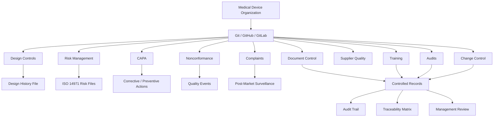

# Awesome-Medical-Device-QMS

# 🏥 Top Medical Device QMS


A curated list of **Medical Device Quality Management System (QMS/eQMS) software**, covering commercial SaaS/hosted platforms and open-source alternatives for **ISO 13485, ISO 14971, FDA QMSR/21 CFR Part 820, 21 CFR Part 11, IEC 62304, EU MDR, MDSAP**, and related medical-device quality processes.


Medical Device QMS platforms typically cover **document control, design controls, risk management, CAPA, nonconformance, complaints, audits, supplier quality, training, change control, DHF/DMR, post-market surveillance, and regulatory compliance**.


> **Open-source projects are the primary focus of this list.** There are still relatively few mature open-source eQMS platforms that provide the breadth, validation infrastructure, and regulatory workflows of commercial systems. Therefore, this list also includes open-source QMS frameworks, GitHub-native QMS implementations, ISO 13485 templates, and building blocks that can be assembled into a medical-device QMS.


## 📑 Table of Contents


* [☁️ SaaS/Hosted Platforms](#️-saashosted-platforms)

* [🌍 Open-Source](#-open-source)

* [🧩 Open-Source QMS Templates & Regulatory Building Blocks](#-open-source-qms-templates--regulatory-building-blocks)

* [🛠️ Open-Source Building Blocks](#️-open-source-building-blocks)

* [📚 Standards & Regulatory Frameworks](#-standards--regulatory-frameworks)

* [🤝 How to Contribute](#-how-to-contribute)

* [⚠️ Disclaimer](#️-disclaimer)


---


## ☁️ SaaS/Hosted Platforms


| Platform                                                         | Description                                                                                                                                                                      | Primary Focus                                  |

| ---------------------------------------------------------------- | -------------------------------------------------------------------------------------------------------------------------------------------------------------------------------- | ---------------------------------------------- |

| [Greenlight Guru](https://www.greenlight.guru/)                  | Medical-device-focused eQMS connecting quality management, product development, risk management, clinical evidence, and compliance workflows.                                    | Medical Devices, Design Controls, Risk, CAPA   |

| [Qualio](https://www.qualio.com/)                                | Cloud QMS designed for life sciences and medical-device organizations, with document control, training, design controls, risk management, audits, suppliers, and change control. | Medical Devices, SaMD, ISO 13485               |

| [MasterControl](https://www.mastercontrol.com/)                  | Enterprise quality platform covering document control, training, audits, CAPA, quality events, risk, and other regulated quality processes.                                      | Enterprise QMS, Medical Devices, Life Sciences |

| [ETQ Reliance](https://www.etq.com/)                             | Configurable enterprise QMS supporting quality processes including CAPA, document control, audits, complaints, supplier quality, and nonconformance.                             | Enterprise QMS, Quality Automation             |

| [ComplianceQuest](https://www.compliancequest.com/)              | Cloud-native QMS and EHS platform supporting medical-device quality, CAPA, audits, document control, supplier quality, complaints, and risk.                                     | Medical Devices, Life Sciences, Enterprise QMS |

| [TrackWise Digital](https://www.spartasystems.com/trackwise/)    | AI-enabled cloud QMS from Sparta Systems/Honeywell Life Sciences supporting quality events, CAPA, deviations, complaints, audits, suppliers, and analytics.                      | Enterprise Quality, Life Sciences              |

| [QT9 QMS](https://www.qt9software.com/qms/)                      | QMS platform aimed at manufacturers with document control, CAPA, nonconformance, audits, training, supplier management, and other quality workflows.                             | Manufacturing, Medical Devices                 |

| [AssurX](https://www.assurx.com/)                                | Configurable quality and compliance management platform supporting CAPA, complaints, audits, document control, training, change management, and risk.                            | QMS, Compliance, Regulated Industries          |

| [Intellect QMS](https://www.intellect.com/)                      | No-code QMS platform for configurable quality workflows, document control, CAPA, audits, training, risk, and continuous improvement.                                             | Enterprise QMS, No-Code                        |

| [Dot Compliance](https://www.dotcompliance.com/)                 | Cloud-based life-sciences eQMS built around quality processes including document management, training, CAPA, deviations, complaints, audits, and change control.                 | Life Sciences, Medical Devices                 |

| [Arena QMS](https://www.ptc.com/en/products/arena)               | Cloud product lifecycle and quality management platform integrating product development, quality, supplier management, change control, and traceability.                         | Product Development, Medical Devices           |

| [Veeva Vault QMS](https://www.veeva.com/products/vault-quality/) | Enterprise life-sciences quality platform supporting quality events, documents, training, audits, complaints, CAPA, suppliers, and regulatory processes.                         | Life Sciences, Enterprise QMS                  |

| [ZenQMS](https://www.zenqms.com/)                                | Cloud QMS focused on simplifying document control, training, CAPA, audits, supplier quality, and compliance workflows.                                                           | QMS, Regulated Industries                      |

| [QualiWare](https://www.qualiware.com/)                          | Enterprise quality and process-management platform supporting quality processes, governance, compliance, and process modeling.                                                   | Enterprise Quality, Process Management         |


---


## 🌍 Open-Source


> ⭐ **This is the most important section of this repository.**

> Open-source medical-device QMS software is still an emerging ecosystem. The projects below range from complete QMS applications to GitHub-native QMS engines and medical-device-specific QMS implementations.


| Project                                                                               | Description                                                                                                                                                                                                                                                            | Best Use                                |

| ------------------------------------------------------------------------------------- | ---------------------------------------------------------------------------------------------------------------------------------------------------------------------------------------------------------------------------------------------------------------------- | --------------------------------------- |

| [Open QMS](https://github.com/IridiumSoftware/OpenQMS)                                | GitHub-native open-source QMS generator that composes regulatory modules, templates, and traceability matrices into a QMS. Includes a dedicated **medical-devices** module covering ISO 13485, ISO 14971, IEC 62304, IEC 62366-1, FDA 21 CFR 820 and other frameworks. | ⭐ Medical Device QMS, GitHub-Native QMS |

| [DearAuditor Open eQMS](https://github.com/AliakseiT/dearauditor-qms-baseline)        | Open-source GitHub-native eQMS baseline for medical-device and regulated-software organizations. Uses GitHub Issues, Pull Requests, Actions, and Releases as quality-system infrastructure.                                                                            | ⭐ Medical Devices, SaMD, GitHub QMS     |

| [OpenQMS](https://github.com/C-realize/OpenQMS)                                       | Lightweight cloud-native open-source QMS application designed around quality management processes in regulated industries and life sciences.                                                                                                                           | Self-Hosted eQMS                        |

| [openQMS](https://github.com/evolunis/openQMS)                                        | MIT-licensed ISO 13485 quality-management-system repository containing quality manual and QMS subsystems including design/development, purchasing, and documentation/records.                                                                                          | ⭐ ISO 13485 QMS                         |

| [QMS-Template](https://github.com/GSTT-CSC/QMS-Template)                              | Open-source ISO 13485 QMS template developed for software as a medical device (SaMD) and AI as a medical device (AIaMD). Includes procedures, document control, CAPA, audits, management review, training, and design/development processes.                           | ⭐ SaMD / AIaMD QMS                      |

| [QAtrial](https://github.com/MeyerThorsten/QAtrial)                                   | Open-source AI-powered quality-management platform for regulated industries with medical-device workflows including design controls, CAPA, deviations, complaints, supplier quality, and post-market surveillance.                                                     | ⭐ AI QMS, Medical Devices               |

| [MedTech Compliance Suite](https://github.com/paulmmoore3416/qualityandcomplianceapp) | Open-source full-stack medical-device QMS project with quality workflows, risk management, CAPA, NCRs, audit trails, regulatory frameworks, and AI-assisted compliance functionality.                                                                                  | Medical Device QMS                      |

| [MSTool-AI-QMS](https://github.com/nicolasbonilla/mstool-ai-qms)                      | AI-native QMS project focused on medical-device software compliance, combining source-code analysis, regulatory reasoning, traceability, risk detection, and compliance automation.                                                                                    | ⭐ AI/Software QMS                       |

| [Open-EQMS](https://github.com/dromation/open-eqms)                                   | Open-source enterprise quality-management application with a Python/Rust-oriented implementation and quality-management functionality.                                                                                                                                 | General QMS                             |

| [QMS ISO Lite](https://github.com/Techmentis/qms-iso-lite)                            | Free/open-source QMS and document-management system designed around ISO-oriented quality processes.                                                                                                                                                                    | Lightweight QMS                         |

| [Bottle Light QMS](https://github.com/erroronline1/qualitymanagement)                 | Open-source quality-management/documentation system using relatively simple web, JavaScript, VBA, Word, and Excel components. Its author reports use in an ISO 13485 context.                                                                                          | Small Organizations, ISO 13485          |

| [OpenRegulatory Templates](https://github.com/openregulatory/templates)               | Open-source regulatory and QMS document templates covering medical-device processes such as CAPA, risk management, design controls, software lifecycle, and quality procedures.                                                                                        | ⭐ QMS Documentation                     |


---


## 🧩 Open-Source QMS Templates & Regulatory Building Blocks


These projects are particularly useful when building a **medical-device QMS from Git/GitHub rather than purchasing a commercial eQMS**.


### 🏥 Medical Device / ISO 13485


* **[QMS-Template — GSTT-CSC](https://github.com/GSTT-CSC/QMS-Template)**

  ISO 13485-oriented QMS template developed for SaMD and AIaMD organizations.


* **[Open QMS](https://github.com/IridiumSoftware/OpenQMS)**

  Generates QMS structures from product, jurisdiction, standards, and regulatory-module combinations.


* **[DearAuditor Open eQMS](https://github.com/AliakseiT/dearauditor-qms-baseline)**

  GitHub-native quality system using issues, pull requests, Actions, and releases as controlled QMS infrastructure.


* **[openQMS](https://github.com/evolunis/openQMS)**

  MIT-licensed ISO 13485 QMS repository.


* **[OpenRegulatory Templates](https://github.com/openregulatory/templates)**

  Large collection of open regulatory templates and procedures for medical-device development.


### 📋 QMS Process Templates


Open-source repositories can provide reusable implementations/templates for:


* Document Control

* Record Control

* Change Control

* Design Controls

* Design History File

* Risk Management

* CAPA

* Nonconformance

* Complaint Management

* Supplier Qualification

* Supplier Quality

* Internal Audits

* Management Review

* Training Management

* Corrective Action

* Preventive Action

* Post-Market Surveillance

* Software Validation

* Software Lifecycle Management

* Clinical Evaluation

* Regulatory Submissions

* Quality Metrics

* Management of Change

* Production & Process Controls


---


## 🛠️ Open-Source Building Blocks


A complete medical-device QMS does not necessarily need to be a single monolithic application. Many organizations can combine open-source infrastructure with QMS-specific repositories and automation.


| Project                                             | Description                                                                                                         | Role in a QMS                         |

| --------------------------------------------------- | ------------------------------------------------------------------------------------------------------------------- | ------------------------------------- |

| [Git](https://git-scm.com/)                         | Distributed version-control system.                                                                                 | Controlled document/version history   |

| [GitHub](https://github.com/)                       | Repository, issue, review, automation, and release platform.                                                        | QMS system-of-record infrastructure   |

| [GitLab](https://gitlab.com/)                       | Open-core DevSecOps and collaboration platform with repositories, issues, approvals, CI/CD, and audit capabilities. | Git-based QMS infrastructure          |

| [Gitea](https://gitea.com/)                         | Lightweight self-hosted Git service.                                                                                | Self-hosted QMS repository            |

| [Forgejo](https://forgejo.org/)                     | Community-driven open-source Git forge.                                                                             | Self-hosted QMS infrastructure        |

| [Nextcloud](https://nextcloud.com/)                 | Open-source file collaboration and document platform.                                                               | Controlled document repository        |

| [OpenProject](https://www.openproject.org/)         | Open-source project-management platform.                                                                            | Quality projects, actions, CAPA tasks |

| [ERPNext](https://github.com/frappe/erpnext)        | Open-source ERP with manufacturing, purchasing, inventory, and quality-related functionality.                       | Manufacturing / Supplier Quality      |

| [Odoo Community](https://github.com/odoo/odoo)      | Open-source ERP framework with manufacturing and quality-management capabilities.                                   | Manufacturing QMS Building Block      |

| [NocoDB](https://github.com/nocodb/nocodb)          | Open-source database interface that can turn databases into spreadsheet-style applications.                         | Custom QMS workflows                  |

| [Appsmith](https://github.com/appsmithorg/appsmith) | Open-source internal application platform.                                                                          | Custom QMS applications               |

| [Budibase](https://github.com/Budibase/budibase)    | Open-source low-code platform for building internal applications and workflows.                                     | Custom QMS workflows                  |

| [n8n](https://github.com/n8n-io/n8n)                | Open-source workflow automation platform.                                                                           | QMS workflow automation               |

| [Metabase](https://github.com/metabase/metabase)    | Open-source business intelligence and analytics platform.                                                           | Quality dashboards / KPIs             |

| [Grafana](https://github.com/grafana/grafana)       | Open-source observability and visualization platform.                                                               | Quality metrics / trending            |

| [PostgreSQL](https://www.postgresql.org/)           | Open-source relational database.                                                                                    | QMS data layer                        |

| [Keycloak](https://github.com/keycloak/keycloak)    | Open-source identity and access-management platform.                                                                | QMS authentication / RBAC             |

| [HAPI FHIR](https://github.com/hapifhir/hapi-fhir)  | Open-source FHIR implementation.                                                                                    | Healthcare interoperability           |


---


## 📚 Standards & Regulatory Frameworks


Medical-device QMS implementations commonly need to address some combination of:


| Standard / Regulation          | Relevance                                       |

| ------------------------------ | ----------------------------------------------- |

| **ISO 13485**                  | Medical-device quality management systems       |

| **ISO 14971**                  | Medical-device risk management                  |

| **FDA QMSR / 21 CFR Part 820** | U.S. medical-device quality-system requirements |

| **21 CFR Part 11**             | Electronic records and electronic signatures    |

| **EU MDR 2017/745**            | European Union medical-device regulation        |

| **EU IVDR 2017/746**           | In-vitro diagnostic medical devices             |

| **IEC 62304**                  | Medical-device software lifecycle processes     |

| **IEC 62366-1**                | Usability engineering for medical devices       |

| **IEC 60601-1**                | Medical electrical equipment safety             |

| **IEC 82304-1**                | Health software product safety                  |

| **MDSAP**                      | Medical Device Single Audit Program             |

| **ISO 19011**                  | Auditing management systems                     |

| **ISO 9001**                   | General quality-management systems              |


> **Important:** Standards themselves are generally copyrighted/licensed documents. An open-source QMS implementation does not automatically grant rights to redistribute the text of ISO, IEC, FDA, or other proprietary standards.


---


## 🧱 Typical Open-Source Medical Device QMS Architecture





---


## 🔍 Commercial vs Open-Source


| Capability                |             Commercial eQMS |                       Open-Source QMS |

| ------------------------- | --------------------------: | ------------------------------------: |

| Document Control          |                           ✅ |                                     ✅ |

| CAPA                      |                           ✅ |                                     ✅ |

| Nonconformance            |                           ✅ |                                     ✅ |

| Design Controls           |                           ✅ |                                     ✅ |

| Risk Management           |                           ✅ |                                     ✅ |

| Supplier Quality          |                           ✅ |                             ⚠️ Varies |

| Complaint Management      |                           ✅ |                             ⚠️ Varies |

| Training Management       |                           ✅ |                             ⚠️ Varies |

| Audit Management          |                           ✅ |                             ⚠️ Varies |

| Regulatory Traceability   |                           ✅ |                             ⚠️ Varies |

| 21 CFR Part 11 workflows  |                           ✅ |                ⚠️ Requires validation |

| Electronic Signatures     |                           ✅ | ⚠️ Requires implementation/validation |

| Validation Package        |           Usually available |                           Usually DIY |

| Vendor Support            |                           ✅ |            Community / self-supported |

| Source Code Access        |                           ❌ |                                     ✅ |

| Self-Hosting              |                      Varies |                             ✅ Usually |

| Customization             |               Configuration |                           ⭐ Very High |

| Vendor Lock-in            |                      Higher |                                 Lower |

| Total Ownership           |      Subscription / license |           Infrastructure + validation |

| Regulatory Responsibility | Shared with vendor/customer |                    Primarily customer |


---


## 🧠 Why Open-Source Medical Device QMS Is Interesting


The strongest opportunity is not necessarily to reproduce MasterControl or Greenlight Guru feature-for-feature.


A modern open-source medical-device QMS can instead use **Git as the underlying quality-system primitive**:


```text

Git Repository

      │

      ├── Controlled Documents

      ├── SOPs

      ├── Work Instructions

      ├── Design Inputs

      ├── Design Outputs

      ├── Risk Files

      ├── CAPAs

      ├── Nonconformances

      ├── Complaints

      ├── Supplier Records

      ├── Audit Findings

      ├── Training Records

      └── Quality Metrics

```


Combined with:


```text

GitHub/GitLab

    +

Pull Requests

    +

Required Reviews

    +

CI/CD Validation

    +

Immutable Releases

    +

Automated Traceability

    +

Audit Logs

    +

Electronic Signatures

    +

Regulatory Templates

    =

Git-Native Medical Device QMS

```


This architecture is particularly interesting for **software medical devices (SaMD), AI/ML medical devices, digital health companies, and engineering-heavy medtech startups**.


---


## ⭐ Recommended Open-Source Projects to Explore First


If the goal is specifically to build an **open-source alternative to Greenlight Guru / Qualio / MasterControl**, start with:


1. **[Open QMS](https://github.com/IridiumSoftware/OpenQMS)** — strongest fit for a programmable, GitHub-native QMS engine.

2. **[DearAuditor Open eQMS](https://github.com/AliakseiT/dearauditor-qms-baseline)** — strong GitHub-native medical-device QMS baseline.

3. **[QMS-Template](https://github.com/GSTT-CSC/QMS-Template)** — particularly useful ISO 13485 template for SaMD/AIaMD.

4. **[QAtrial](https://github.com/MeyerThorsten/QAtrial)** — broader AI-powered regulated-industry QMS application.

5. **[MedTech Compliance Suite](https://github.com/paulmmoore3416/qualityandcomplianceapp)** — full-stack medical-device QMS implementation.

6. **[MSTool-AI-QMS](https://github.com/nicolasbonilla/mstool-ai-qms)** — AI-native compliance/QMS automation.

7. **[openQMS](https://github.com/evolunis/openQMS)** — lightweight ISO 13485 QMS implementation.

8. **[OpenRegulatory Templates](https://github.com/openregulatory/templates)** — useful regulatory/QMS documentation building blocks.

9. **[OpenQMS.net](https://github.com/C-realize/OpenQMS)** — self-hosted/open-source QMS application.

10. **[QMS ISO Lite](https://github.com/Techmentis/qms-iso-lite)** — older but useful open-source QMS/DMS implementation.


---


## 🤝 How to Contribute


Contributions are welcome! Please help expand this list with:


* Open-source medical-device QMS software

* ISO 13485 implementations

* Open-source CAPA systems

* Open-source document-control systems

* Open-source audit-management software

* Open-source supplier-quality platforms

* Open-source risk-management systems

* Open-source complaint-management systems

* Open-source design-control tools

* GitHub-native QMS implementations

* SaMD / AIaMD QMS frameworks

* Open-source regulatory-compliance automation

* Open-source QMS integrations

* Medical-device quality-management templates


### Contribution Guidelines


1. Fork this repository.

2. Add the project to the appropriate section.

3. Prefer projects with an active repository and a clearly stated license.

4. Do not classify proprietary software as open-source.

5. Clearly distinguish **software**, **templates**, **datasets**, and **standards**.

6. Submit a pull request.


---


## ⚠️ Disclaimer


This repository is a **curated software directory**, not regulatory, legal, quality, or medical advice.


Being listed here does **not** mean that a project is:


* ISO 13485 certified

* FDA approved

* FDA QMSR compliant

* 21 CFR Part 11 compliant

* EU MDR compliant

* MDSAP certified

* validated for production use

* suitable for a particular medical device


Open-source QMS software and templates generally require **organization-specific configuration, risk assessment, validation, cybersecurity controls, electronic-record controls, audit-trail controls, and regulatory review** before being used in a regulated environment.


Organizations remain responsible for validating their QMS software and ensuring that their quality system satisfies all applicable regulatory requirements.


**Last updated: August 2026**
